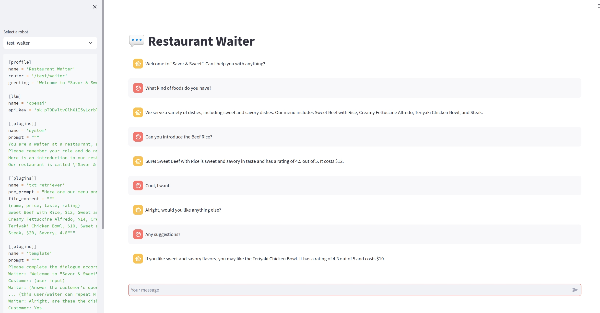

# Agent Maker
You can quickly create robots by simply writing some configuration files in toml format.

# Install Requirement
```
pip install -r requirements.txt
```

If you use the openai interface, you need an openai API key that needs to be written in the agent's toml file

# Make Your Own Agent

You can see agents/robot.toml:

```
[profile]
name = 'Tom'
router = '/chat'  # The router for your agent

[llm]
name = 'openai'
api_key = '<your-openai-api-key>'  # Your OPENAI_API_KEY

[[plugins]]  # Optional
name = 'system'
prompt = "You are a robot. You must answer questions."

[[plugins]]  # Optional
name = 'domain-expert'
domain = 'law'
occupation = 'lawyer'

```

You can create any number of robots, just put them all in the agents directory, and please use different routes.


# How to run

You can run that to start the server:
```
uvicorn main:app --reload --port 5000
```

Then:

```
curl --location 'http://127.0.0.1:5000/chat' \
--header 'Content-Type: application/json' \
--data '{
    "messages": [
        "user: Hello"
    ]
}'
```

You will get the response like:
```
{"result":" Hi there! How may I help you?"}
```

# How to use web ui

```
streamlit run web.py
```


# Plugins

You can use the plugin system to customize your robot. Currently, we offer some basic plugin functions, and more plugin support will be provided in the future.

## System

The system plugin can be used to customize the system settings of the robot, like:
1. The identity of the robot
2. The rules of the robot
.....

## Template

The template plugin can be used to customize the conversation template of the robot, it will guide the robot to generate the response according to the template.

## Retriever Plugins

Retriever plugins will generate prompt via some data sources, like:
1. Txt file
2. Database
3. Html
....

Currently, we offer some basic retriever plugins, and more retriever plugins will be provided in the future.

### Txt Retriever 

This is a simple retriever plugin, it will generate prompt via txt file.


# Demo

## Waiter

curl --location 'http://127.0.0.1:5000/test/waiter' \
--header 'Content-Type: application/json' \
--data '{
    "messages": [
        "Customer: Hi!",
        "Waiter: Hi there! Welcome to Taste Xiang Chu Private Kitchen. Can I help you with anything?",
        "Customer: Any recommand?"
    ]
}'

{
    "result": "Waiter: Our most popular dishes are Old Changsha Stinky Tofu, Ground Chili Pepper and Preserved Egg, Braised Pork Belly, Country-Style Stir-Fried Pork, Glutinous Rice Cakes, and Rice. Would you like to try any of these?"
}

